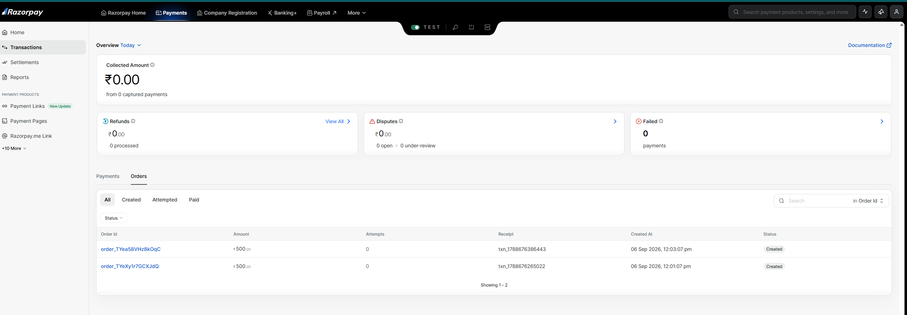
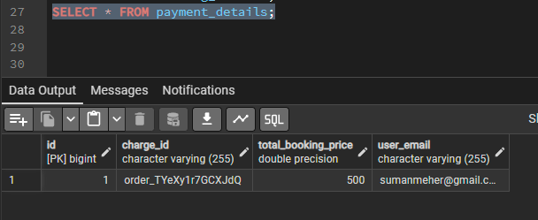

<div align="center">
  
  <br />
  

### Movie Booking Backend System

**A robust, scalable, and highly concurrent movie ticketing system.**

  <br />


</div>

<br />

PopcornTime handles the complete lifecycle of movie ticketing from browsing cities, theatres, and movies, to selecting seats, handling concurrent bookings, and processing payments.

This project demonstrates advanced backend concepts such as **distributed locking for concurrency control**, **asynchronous messaging for email notifications**, and **strategy design patterns** for multi-provider payment processing.

---

## 📑 Table of Contents

- [🚀 Key Features](#key-features)
- [🏗️ System Architecture](#system-architecture)
- [🚦 Core Mechanics](#core-mechanics)
- [🛠️ Tech Stack](#tech-stack)
- [🗄️ Database Schema](#database-schema)
- [⚙️ Setup and Running Locally](#setup-and-running-locally)
- [🌟 What Makes This Stand Out?](#what-makes-this-stand-out)
- [🧗 Challenges Faced](#challenges-faced)

---

<a name="key-features"></a>

##  Key Features

| Feature                    | Description                                                                                   |
| :------------------------- | :-------------------------------------------------------------------------------------------- |
| 🔐 **JWT Authentication**  | Secure user registration and login using JSON Web Tokens.                                     |
| 🏢 **Domain Model**        | Hierarchical relationships between Cities, Theatres, Screens, Movies, and Shows.              |
| 🔴 **Concurrent Booking**  | Prevents double-booking using Redis-based distributed locking with TTL.                       |
| 📨 **Async Notifications** | Uses RabbitMQ to decouple checkout from email delivery for low latency.                       |
| 💳 **Pluggable Payments**  | Strategy Pattern dynamically resolves gateways (Razorpay, GPay) without modifying core logic. |
| 🛡️ **Idempotency**         | Prevents duplicate payments from network retries using unique UUIDs.                          |
| 🐳 **Dockerized**          | Containerized deployment for the API, PostgreSQL, Redis, and RabbitMQ.                        |

---

<a name="system-architecture"></a>

##  System Architecture

PopcornTime follows a standard Spring Boot layered architecture (Controllers -> Services -> Repositories -> Database).

1. **Client** makes REST API calls.
2. **Spring Security (JWT)** intercepts requests and validates user identity.
3. **Services** execute core business logic and interact with the **PostgreSQL** database via Spring Data JPA.
4. **Redis** acts as an in-memory datastore for temporary session data and seat-locking.
5. **RabbitMQ** acts as a message broker to queue asynchronous events (emails and failed payment compensation).

```
                            👤 Client (Web/Mobile)
                                      │
                                      ▼
                        ┌──────────────────────────┐
                        │   ⚡ Spring Boot API     │
                        │   (REST Controllers)     │
                        └─────────────┬────────────┘
                                      │
                   ┌──────────────────┴──────────────────┐
                   │                                     │
             [Read Heavy]                          [Write Heavy]
                   ▼                                     ▼
      ┌──────────────────────────┐         ┌──────────────────────────┐
      │  🎬 Browse & Search      │         │  🔐 Seat Reservation     │
      │  (Cities, Movies, Shows) │         │  (Concurrency Handling)  │
      └────────────┬─────────────┘         └─────────────┬────────────┘
                   │                                     │
                   ▼                                     ▼
      ┌──────────────────────────┐         ┌──────────────────────────┐
      │  ⚡ Redis Cache          │         │  🔴 Redis Distributed    │
      │  (High-Speed Reads)      │         │      Lock (6m TTL)       │
      └──────────────────────────┘         └─────────────┬────────────┘
                                                         │
                                                         ▼
                                           ┌──────────────────────────┐
                                           │  💳 Payment Strategy     │
                                           │  (Razorpay / GPay)       │
                                           └─────────────┬────────────┘
                                                         │
                                                         ▼
                                           ┌──────────────────────────┐
                                           │  🐘 PostgreSQL (DB)      │
                                           │  (Commit Transactions)   │
                                           └─────────────┬────────────┘
                                                         │
                                                         ▼
                                           ┌──────────────────────────┐
                                           │  📨 RabbitMQ Broker      │
                                           │  (Async Email Queue)     │
                                           └─────────────┬────────────┘
                                                         │
                                                         ▼
                                           ┌──────────────────────────┐
                                           │  📧 Background Worker    │
                                           │  (SendGrid / SMTP)       │
                                           └──────────────────────────┘
```

---

<a name="core-mechanics"></a>

##  Core Mechanics

### 1. Concurrent Booking - How it Works

When multiple users try to book the exact same seat simultaneously, a race condition occurs. PopcornTime solves this by implementing a **Temporary Lock Mechanism via Redis**:

```
           👤 User 1                 👤 User 2
              │                          │
              ▼                          ▼
     [Books Seat A1]            [Books Seat A1]
              │                          │
              └───────────┐  ┌───────────┘
                          ▼  ▼
                 ┌────────────────────┐
                 │ ⚡ Spring Boot API │
                 └─────────┬──────────┘
                           │
                 [Checks DB: Available?]
                           │
                           ▼
                 ┌────────────────────┐
                 │ 🔴 Redis (SETNX)   │
                 └─────────┬──────────┘
                           │
          ┌────────────────┴────────────────┐
          ▼                                 ▼
   [Lock Acquired]                   [Lock Denied]
    (User 1 Wins)                     (User 2 Fails)
          │                                 │
          ▼                                 ▼
 ┌─────────────────┐               ┌─────────────────┐
 │ 🟢 200 OK       │               │ 🔴 409 Conflict │
 │ (6 min to pay)  │               │ (Seat Taken)    │
 └─────────────────┘               └─────────────────┘
```

1. The user requests to book a seat.
2. The system checks the database to ensure it's not permanently booked.
3. The system attempts to write a unique lock key (`showId-seatId`) to **Redis**.
4. If the key already exists, an exception is thrown, notifying the user the seat is currently held by someone else.
5. If the key is successfully written, a **TTL (Time-To-Live)** of X minutes is attached. The user now has a limited window to complete the payment.
6. Upon successful payment, the seat is saved permanently to PostgreSQL, and the Redis lock is deleted. If the payment fails or times out, the Redis key expires, freeing the seat for other users.

### 2. Async Email Service - How it Works

Sending an email synchronously during checkout creates massive latency for the end-user. To solve this, PopcornTime uses **RabbitMQ**:

```
          👤 User
             │
             ▼ (Checkout Success)
    ┌────────────────────┐
    │ ⚡ Spring Boot API │
    │   (SeatService)    │
    └────────┬───────────┘
             │
    [Pushes Email Payload]
             │
             ▼
    ┌────────────────────┐
    │ 📨 RabbitMQ Broker │ ── (Instantly Returns 200 OK to User) ──► 🟢 User is happy!
    │  (email_exchange)  │
    └────────┬───────────┘
             │
    [Message waits in queue]
             │
             ▼
    ┌────────────────────┐
    │ 📧 Email Consumer  │
    │  (Background Job)  │
    └────────┬───────────┘
             │
    [Sends via SMTP]
             │
             ▼
      ✉️ Inbox (User)
```

1. Once a payment is successful, the `SeatService` packages an `EmailDetails` payload.
2. It pushes this payload to a RabbitMQ `email_exchange` and immediately returns a `200 OK HTTP Response` to the client.
3. The message sits safely in the `email_queue`.
4. A separate worker/microservice (Email Consumer) listens to this queue, picks up the message, and sends the actual SMTP email in the background without affecting the user's booking experience.

---

<a name="tech-stack"></a>

##  Tech Stack

- **Java 17 & Spring Boot 3**: Core backend framework.
- **Spring Security & JWT**: Authentication and Authorization.
- **PostgreSQL**: Primary relational database.
- **Redis**: Caching and Distributed Locks.
- **RabbitMQ**: Message Broker for async tasks.
- **Hibernate / Spring Data JPA**: ORM for database interactions.
- **Docker & Docker Compose**: Containerization and local infrastructure orchestration.

---

<a name="database-schema"></a>

##  Database Schema (Overview)

### 🏙️ Core Hierarchy

| Table Name  | Description                       | Columns                                       | Connections (Foreign Keys)  |
| :---------- | :-------------------------------- | :-------------------------------------------- | :-------------------------- |
| **City**    | Represents a geographic location. | `id`, `name`                                  | _(None)_                    |
| **Theatre** | A physical cinema building.       | `id`, `name`, `address`, `city_id`            | `city_id` ➡️ **City**       |
| **Screen**  | A viewing hall inside a Theatre.  | `id`, `name`, `total_seats`, `theatre_id`     | `theatre_id` ➡️ **Theatre** |
| **Seat**    | Individual seats inside a Screen. | `id`, `seat_number`, `is_booked`, `screen_id` | `screen_id` ➡️ **Screen**   |

### 🎬 Movies & Shows

| Table Name    | Description                       | Columns                                        | Connections (Foreign Keys)                             |
| :------------ | :-------------------------------- | :--------------------------------------------- | :----------------------------------------------------- |
| **Movie**     | Movie metadata.                   | `id`, `title`, `duration`, `language`, `genre` | _(None)_                                               |
| **MovieShow** | A scheduled screening of a Movie. | `id`, `show_time`, `movie_id`, `screen_id`     | `movie_id` ➡️ **Movie** <br> `screen_id` ➡️ **Screen** |

### 🎟️ Users & Bookings

| Table Name         | Description              | Columns                                                | Connections (Foreign Keys)                                                          |
| :----------------- | :----------------------- | :----------------------------------------------------- | :---------------------------------------------------------------------------------- |
| **AppUser**        | Registered users.        | `id`, `email`, `password`, `first_name`, `last_name`   | _(None)_                                                                            |
| **BookingDetails** | Confirmed bookings.      | `id`, `booking_time`, `user_id`, `show_id`, `seat_id`  | `user_id` ➡️ **AppUser** <br> `show_id` ➡️ **MovieShow** <br> `seat_id` ➡️ **Seat** |
| **PaymentDetails** | Records of transactions. | `id`, `charge_id`, `total_booking_price`, `user_email` | _(Decoupled, references email)_                                                     |

<p align="right"><a href="#-table-of-contents">⬆️ Back to Top</a></p>

---

<a name="setup-and-running-locally"></a>

##  Setup and Running Locally

### Prerequisites

- Docker and Docker Compose installed.
- JDK 17 (if running outside Docker).

### Steps

1. Clone the repository.
2. Create an `.env` file in the root directory (or configure environment variables) with your credentials:
   ```env
   DB_USERNAME=your_db_user
   DB_PASSWORD=your_db_pass
   RABBITMQ_USERNAME=guest
   RABBITMQ_PASSWORD=guest
   JWT_SECRET=your_super_secret_jwt_key
   RAZORPAY_KEY_ID=your_razorpay_key
   RAZORPAY_KEY_SECRET=your_razorpay_secret
   ```
3. Run the application via Docker Compose:
   ```bash
   docker-compose up -d
   ```
4. The API will be available at `http://localhost:8080`.
5. RabbitMQ Management UI (if port 15672 is exposed) will be at `http://localhost:15672`.

<p align="right"><a href="#-table-of-contents">⬆️ Back to Top</a></p>

---

<a name="what-makes-this-stand-out"></a>

##  What Makes This Stand Out?

- **Production-Ready Concurrency Handling**: Going beyond standard CRUD by handling real-world e-commerce edge cases like double-booking and payment fallbacks.
- **Microservices Ready**: By isolating the email delivery to a message broker, this monolith is already prepared to scale out into a microservices architecture.
- **SOLID Principles**: Utilizing Strategy design patterns for payments ensures the code is Open for extension but Closed for modification.

---

<a name="challenges-faced"></a>

##  Challenges Faced

1. **Race Conditions during Checkout**: Preventing multiple users from booking the exact same seat simultaneously.
   - **The Challenge (The "Double Booking" Disaster):** Initially, I relied solely on PostgreSQL to check if a seat was `AVAILABLE` before initiating a checkout. However, during load testing, I discovered a major race condition: if User A and User B queried the database at the exact same millisecond, both read the seat as available and proceeded to payment, resulting in two users booking the exact same seat!
   - **The Solution:** I implemented a **Distributed Lock using Redis**. Now, the moment a user selects a seat, the system executes an atomic `SETNX` (Set if Not eXists) command in Redis with the `showId-seatId`. Because Redis is single-threaded and incredibly fast, it guarantees only one user acquires the lock. The winning user gets a 6-minute TTL window to pay, while competing users get an instant `409 Conflict` error.
2. **Distributed Transactions (Dual Write Problem)**: Handling the scenario where the third-party payment succeeds, but the database connection drops before saving the ticket.
   - **The Challenge (The "Ghost" Payment):** During load testing, I encountered a classic dual-write failure. An order was successfully created in Razorpay (charging the user), but the application crashed or the database connection dropped _before_ it could save the `payment_details` to PostgreSQL. This resulted in severe data inconsistency: as seen in the evidence, there were **2 successful orders** on the Razorpay dashboard, but only **1 record** saved in the local database!
   - **The Solution:** I implemented an **Idempotency Key** during the checkout flow and a RabbitMQ fallback queue (`unsavedPaymentDetailsExchange`). If the database save fails after a successful payment, the payload is pushed to the message broker. A background worker will continuously retry the database save later, guaranteeing eventual consistency between the payment gateway and the system.

   <br/>

   <div align="center">
     
     <br>
     <i>Evidence: Razorpay Dashboard showing 2 successful orders created.</i>
     <br><br>
     
     <br>
     <i>Evidence: Database table showing only 1 order was saved due to a simulated crash.</i>
   </div>
